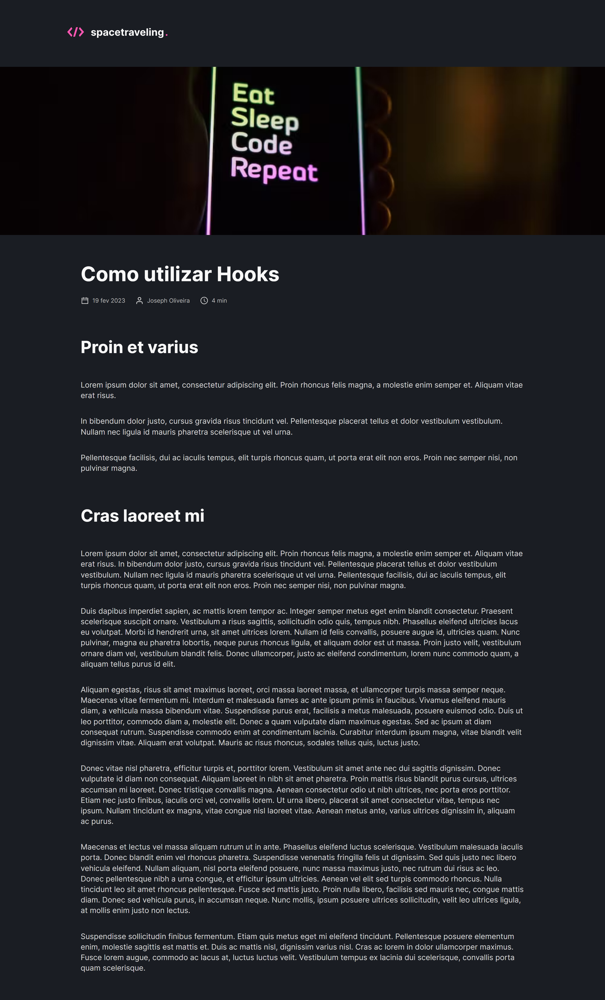

# Space Traveling - Desafio 5

<!---Esses são exemplos. Veja https://shields.io para outras pessoas ou para personalizar este conjunto de escudos. Você pode querer incluir dependências, status do projeto e informações de licença aqui--->


<a href="https://github-blog-sid.netlify.app/" target="_blank">Demo</a>



<br />

# Sobre

Projeto desenvolvido durante o desafio 5 do curso Ignite da Rocketseat. O projeto consiste em uma aplicação de blog, onde é possível listar posts ja criados com o cms Prismas.

<br/>

## 🖱 Pré-requisitos

Antes de começar, verifique se você atendeu aos seguintes requisitos:

- Você instalou a versão mais recente de `node / npm / yarn`
  <br />

## ☕ Usando o Space Traveling - Desafio 5

Para usar o Space Traveling, siga estas etapas:

```
git clone https://github.com/SidneyRoberto9/space-traveling-desafio-5

yarn ou npm i

Em uma .env cria a variavel:
PRISMIC_API_ENDPOINT="seu endpoint"

yarn start ou npm start
```
